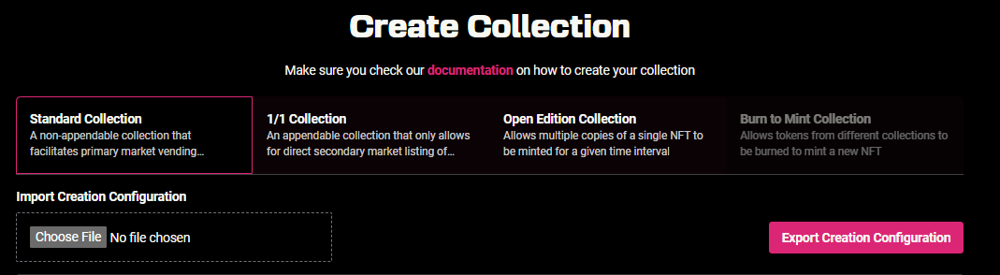

# Create an NFT Collection

## Steps of Creating an NFT Collection

Creating an NFT collection consists of two main steps; **storing assets** and **configuring collection details and settings.**&#x20;

Stargaze Studio allows you to handle all the steps on a single page without writing a line of code. Stargaze Studio is recommended for all creators.&#x20;

This tutorial will cover the following:

* Storage options, uploading assets and metadata
* Configuring collection and minting details
* Whitelist and Royalty settings (optional)

## Choosing a Collection Type

The first step is deciding what type of collection best fits your project. \
\
There are 3 types of collections that can be created through Stargaze Studio at present with a guide for each:

<figure><figcaption></figcaption></figure>


In all cases, it is **highly recommended** to first launch your collection on [**testnet**](https://studio.publicawesome.dev) before launching on [**mainnet**](https://studio.stargaze.zone)**.**


**1) Standard Collection**

A collection of up to 10,000 unique NFTs that utilizes the Stargaze randomized minter. This is the most common collection type for things like PFP collections.\
\
[Jump to Creating a Standard Collection](/broken/pages/ZiBCjJxOPyUxnmVBSm6G)

**2) Open/Limited Edition Collection**

A single NFT that can be minted multiple times within a timeframe or quantity defined by the creator. This is commonly used by artists selling multiple copies of a single piece of art or for ticketing.\
\
[Jump to Creating an Open/Limited Edition Collection](/broken/pages/U2NOkdhfBvIqInAEmVA2)\
\
**3) 1/1 Collection**\
\
A collection created with a single NFT minted automatically to the creator's wallet and more NFTs can be added by the creator over time. This is commonly used for custom profile picture collections or other ongoing collections such as commissions.

[Jump to Creating a 1/1 Collection](/broken/pages/CkStb2SXrQ0kQZNAEAN2)


In all cases, it is **highly recommended** to first launch your collection on [**testnet**](https://studio-testnet.stargaze.zone/) before launching on [**mainnet**](https://studio.stargaze.zone)**.**

