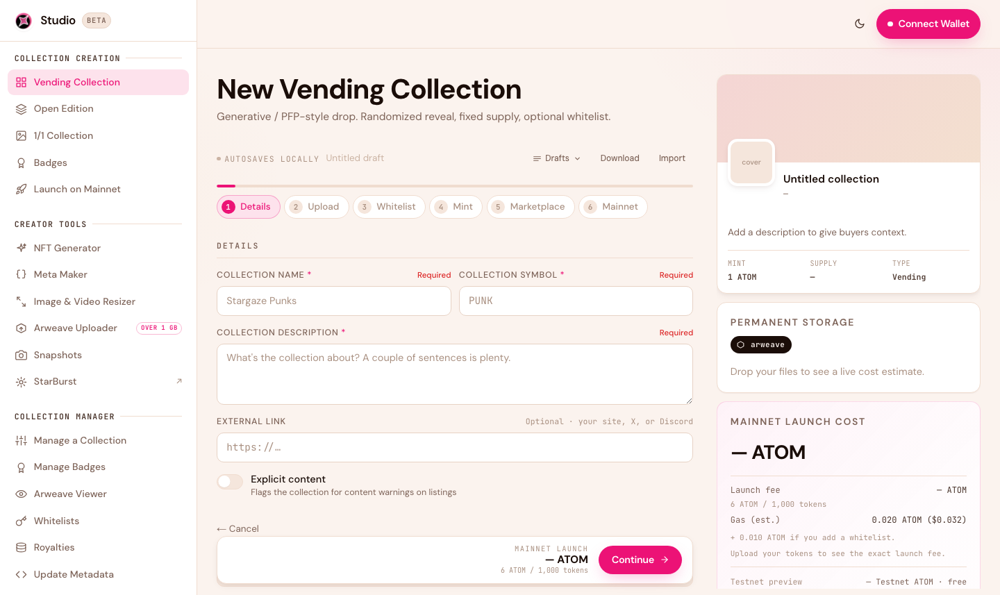

# Costs & Fees

Studio 2.0 is transparent about cost: every fee is shown **live, before you confirm**. The on-chain steps are free to rehearse on testnet, while permanent Arweave storage is real from the very first upload. This page explains what makes up the total so there are no surprises.

<figure><figcaption>The launch panel breaks down storage, fees, and gas before you commit.</figcaption></figure>

## What's free — and what isn't — on testnet

Rehearsing the **on-chain** parts on the Cosmos Hub testnet costs nothing: creating the collection, minting, and whitelists all run on free testnet ATOM, which the app tops up for you automatically. Build, launch, and preview as many times as you like.

**Storage is the exception.** Arweave has no testnet, so the moment you upload your art and metadata they're stored permanently, for real. That happens once — the same files are reused when you promote to mainnet, so you never pay for storage twice.

## What you pay on mainnet

A mainnet launch is made of a few parts, all shown in the app before you sign:

| Cost | What it's for | Notes |
|---|---|---|
| **Permanent storage** | Storing your art + metadata on Arweave, forever | One-time, priced by total file size (a set rate per gigabyte). Paid in ATOM. |
| **Collection creation fee** | The on-chain fee to create your collection | Depends on the type and size (for example, a Vending drop is priced per 1,000 tokens). |
| **Whitelist fee** | Deploying a whitelist contract, if you add one | Small, optional. |
| **Network gas** | The blockchain transaction fee | A fraction of an ATOM per action. |


**You never pay for storage twice.** Because your files are already on Arweave from the testnet build, promoting to mainnet only costs the on-chain creation fee and gas — not another storage charge.


## Keep storage cost down

Because permanent storage is priced by size, the best way to lower it is to **shrink your files first**. Use the [Image & Video Resizer](creator-tools.md) to convert images to WebP and compress video before you upload — smaller files mean a smaller permanent-storage bill.

## Ongoing costs

There are **none** for storage — that's the whole point of Arweave. You pay once and your art is kept permanently, with no monthly bills or renewals. After launch, you only pay small network gas fees when you take an action in the [Collection Manager](managing-your-collection.md) (updating price, airdropping, withdrawing, etc.).

## What you earn

* **When people mint:** you receive the **mint price minus Stargaze's 8% platform fee** — so about 92% of each mint. (For example, on a 10 ATOM mint you'd receive ~9.2 ATOM.) Minters also pay a small gas fee to the network.
* **When holders resell:** secondary sales on the Stargaze marketplace include a **2% marketplace fee** plus your **creator royalty**, both paid by the seller. Your royalty lands in your royalty wallet automatically — no action needed.

See [Fees](../collect/fees.md) for the complete buyer/seller fee schedule, and [Managing Your Collection](managing-your-collection.md) to set your royalty.

## A note on mint tokens

Your collection can be minted in **ATOM or STARS** — you choose. Note that this is separate from the fees above: creation fees, storage, whitelist deployment, and gas are always paid in **ATOM** by the network, even if your collection is minted in STARS.

## Next steps

* [What is Arweave?](what-is-arweave.md) — why storage is pay-once
* [Getting Started](getting-started.md) — the testnet-first workflow
