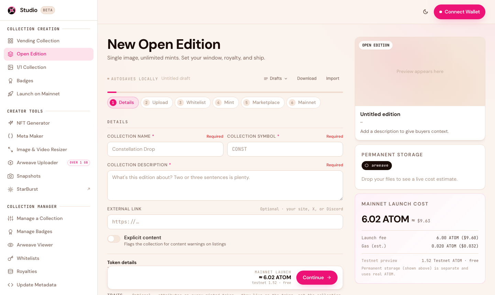
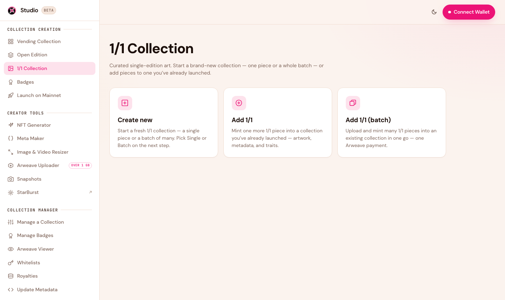
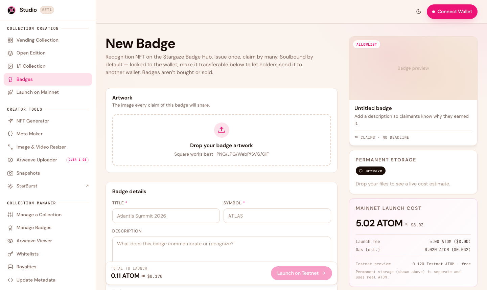

# Creating a Collection

Studio 2.0 supports four kinds of collections. They all share the same guided flow — you fill in details, upload art, set your mint rules, and launch — but each is tuned for a different kind of collection. Pick the one that matches what you're building.

## The create flow

Every creation flow is a short, guided wizard. Using a Vending collection as the example, the steps are:

<figure><figcaption>The create wizard: fill each step, watch the live cost panel, launch on testnet, then promote to mainnet.</figcaption></figure>

1. **Details** — name, symbol, description, external link.
2. **Upload** — your artwork and metadata. Studio quotes the permanent-storage cost live as you add files.
3. **Whitelist** *(optional)* — allowlist phases and presale pricing. See [Whitelists](whitelists.md).
4. **Mint** — supply, price, per-wallet limits, and the mint window (start/end times).
5. **Marketplace** — royalties and secondary-trading start.
6. **Mainnet** — launch on testnet to rehearse, then promote to mainnet.

Your work **autosaves locally as a draft**, and you can **Download** or **Import** a draft to move it between devices.


All times use a **UTC / local toggle**. Times shown in your local zone are labelled "(local time)" so there's never any ambiguity about when your mint opens.



**One NFT standard underneath.** Every collection type uses the **CW721** standard on Cosmos Hub, so they all work with the Stargaze marketplace and support on-chain creator royalties. What changes between types is the minting mechanics — not the underlying NFT.


## Collection types

### PFP / Generative (Vending)

The classic profile-picture drop: a fixed supply of items revealed randomly as people mint. Best for generative collections built from layered traits (100s to 10,000s of pieces). Pairs perfectly with the [NFT Generator](creator-tools.md).

[Create a Vending collection →](https://studio.stargaze.zone/collections/vending/create)

### Open Edition

<figure><figcaption>Open Edition — one artwork, minted as many times as you allow.</figcaption></figure>

A single artwork minted as many times as you want, usually within a time window. The fastest path from an idea to a live drop — no per-token art needed.

[Create an Open Edition →](https://studio.stargaze.zone/collections/open-edition/create)

### 1/1

<figure><figcaption>1/1 — curated single-edition art, each token with its own image and metadata.</figcaption></figure>

For one-of-a-kind pieces, each with its own image and metadata. You create the collection, then add your 1/1 tokens to it — one at a time or as a batch.

Unlike Vending and Open Edition drops, a 1/1 collection has **no launchpad or public mint page**. Each piece is minted **directly to your own wallet** as you add it. From there, you can **list it for sale on the Stargaze marketplace**, or transfer or airdrop it to someone — it's yours to do with as you like.

[Create a 1/1 collection →](https://studio.stargaze.zone/collections/base/create)

### Badges

<figure><figcaption>Badges — soulbound recognition NFTs for communities, events, and contributors.</figcaption></figure>

Soulbound (non-transferable) NFTs for recognition — event attendance, community roles, contributions. Choose how they're claimed: open mint, allowlist, or signed claim keys.

[Create a Badge →](https://studio.stargaze.zone/badges/create)

## Next steps

* [Whitelists](whitelists.md) — add allowlist phases and presale pricing
* [Manage Your Collection](managing-your-collection.md) — change pricing, timing, and metadata after launch
* [Costs & Fees](costs-and-fees.md) — what each type costs to launch
