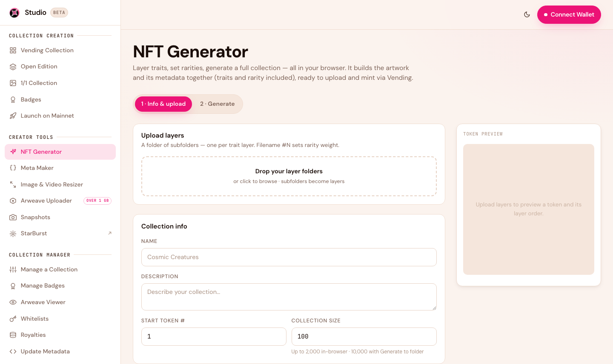
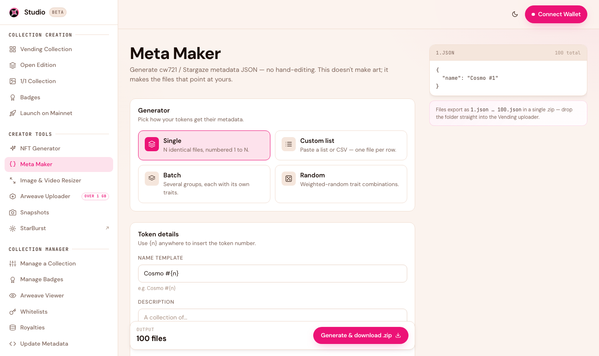
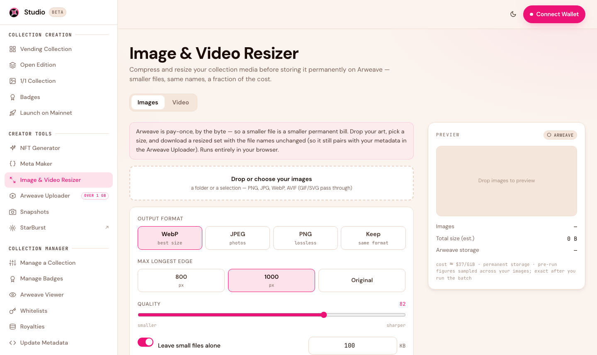
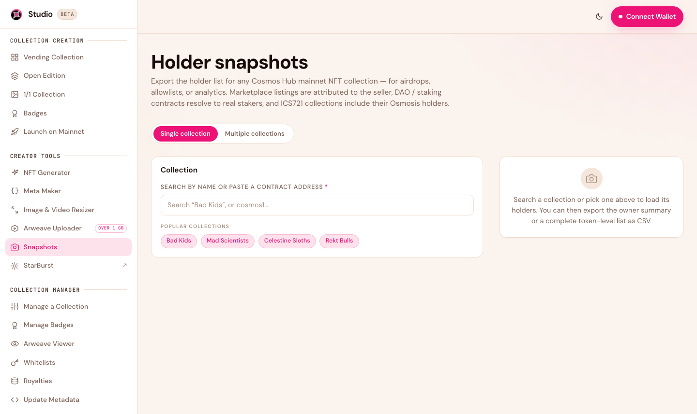
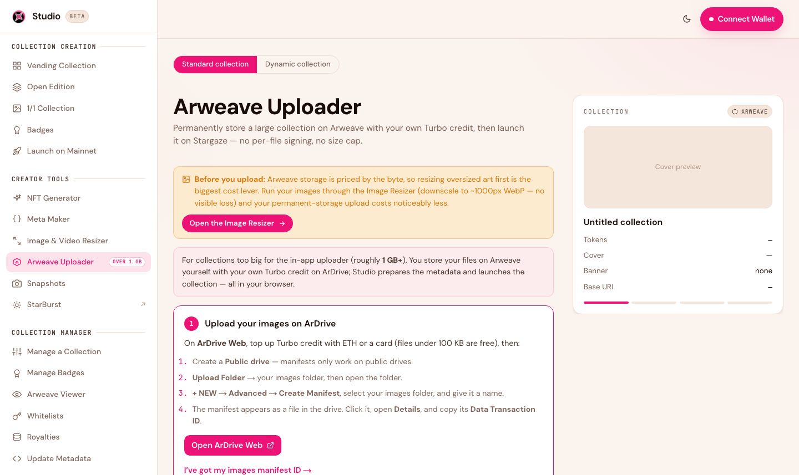

# Creator Tools

Studio 2.0 bundles the utilities you need to prepare and run a collection — generating art, building metadata, optimizing files, and snapshotting holders — so you don't have to leave the app or hand-edit files.

## NFT Generator

<figure><figcaption>Layer traits, set rarities, and generate a full collection — art and metadata together — in your browser.</figcaption></figure>

Build a full generative collection from a folder of trait layers. Set rarity weights, add exclusion rules and required pairs, reserve 1/1s, and generate the artwork **and** its metadata together — ready to upload and mint via Vending. Everything runs in your browser (up to 2,000 tokens in-app, more via generate-to-folder).

[Open the NFT Generator →](https://studio.stargaze.zone/stargen)

## Meta Maker

<figure><figcaption>Generate CW721 / Stargaze-compliant metadata JSON without hand-editing files.</figcaption></figure>

Generate correctly-formatted metadata JSON without touching a text editor. Modes include a single repeated template, a custom list (paste names or a CSV), batches with their own traits, and weighted-random combinations. Output drops straight into the Vending uploader.

[Open Meta Maker →](https://studio.stargaze.zone/meta-maker)

## Image & Video Resizer

<figure><figcaption>Compress images and video before paying for permanent storage.</figcaption></figure>

Compress your images (to WebP) and video (to MP4) before you upload. Because Arweave storage is priced by file size, shrinking your files first is the simplest way to keep your permanent-storage cost low — often just cents for a whole collection.

[Open the Resizer →](https://studio.stargaze.zone/resizer)

## Snapshots

<figure><figcaption>Export a holder or owner list from any collection — ready for airdrops and allowlists.</figcaption></figure>

Export a holder or owner list from any Cosmos Hub collection as a CSV — the foundation for airdrops and whitelists. Snapshots resolves staking/DAO contracts to real holders, merges holdings across Cosmos Hub and Osmosis for bridged collections, and offers an addresses-only export for allowlists.

[Open Snapshots →](https://studio.stargaze.zone/snapshots)

## Arweave Uploader

<figure><figcaption>Permanently store a large collection on Arweave with your own credit, then launch.</figcaption></figure>

For large or advanced uploads (including collections over 1 GB and the Dynamic HTML flow), the Uploader stores your files permanently on Arweave and gives you back the permanent addresses to launch with. See [Creating a Collection → Dynamic](creating-a-collection.md) for the generative-HTML workflow.

[Open the Uploader →](https://studio.stargaze.zone/uploader)

## Next steps

* [Creating a Collection](creating-a-collection.md) — turn your generated art into a live drop
* [Whitelists](whitelists.md) — use a snapshot as an allowlist
