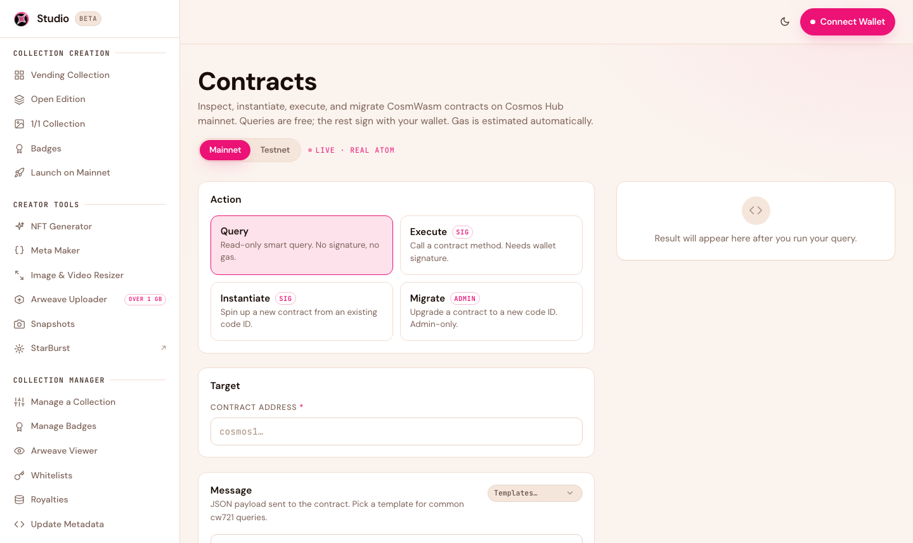
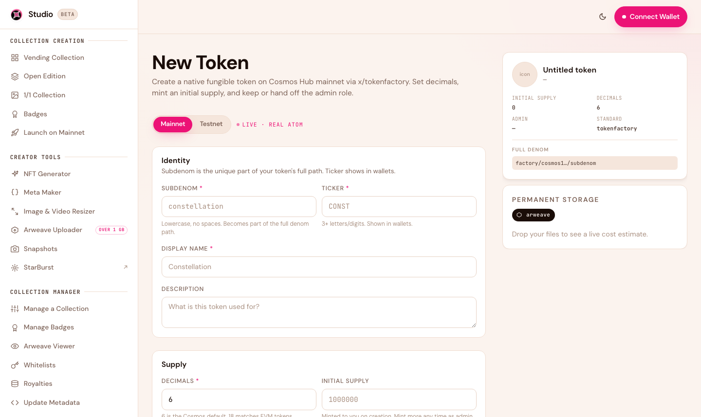
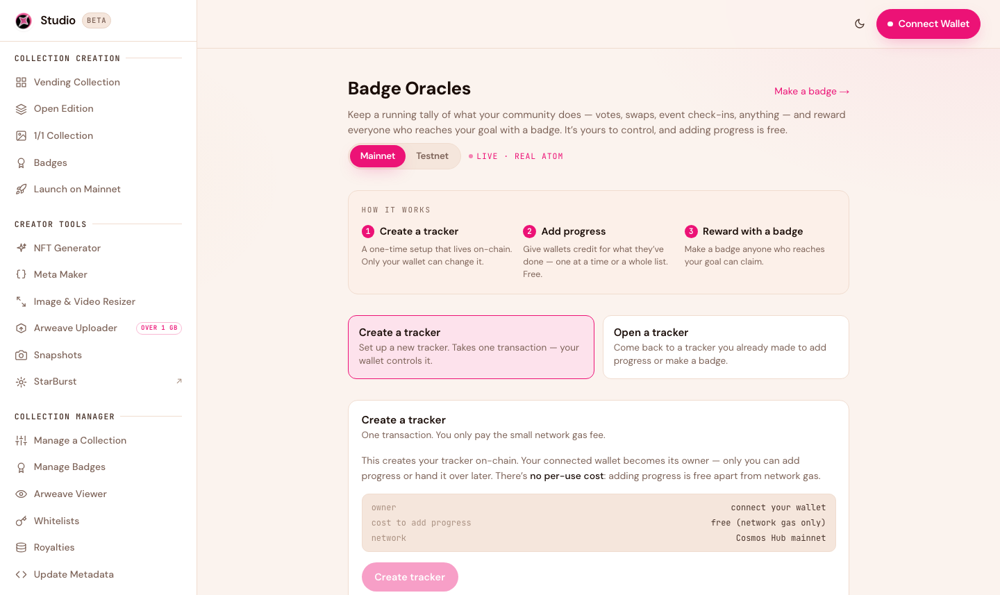
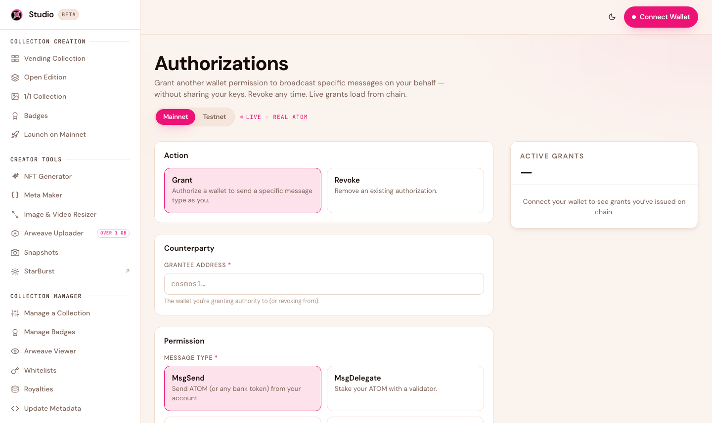

# Developer Tools

Studio 2.0 includes a set of advanced, on-chain tools for power users and builders. You don't need these to launch a normal collection — but they're there when you want direct control.


These tools broadcast real transactions to the blockchain. Use the **testnet** toggle to experiment safely before doing anything on mainnet.


## Contract Console

<figure><figcaption>Query and execute against any CosmWasm contract directly.</figcaption></figure>

Send raw queries and execute messages against any CosmWasm contract. Useful for inspecting contract state or running actions Studio doesn't expose in its guided flows.

[Open the Contract Console →](https://studio.stargaze.zone/contracts)

## Token Factory

<figure><figcaption>Create a native token denom via the chain's token factory module.</figcaption></figure>

Create a native token denomination using the chain's `x/tokenfactory` module. Handy for projects that need their own native denom alongside their NFTs.

[Open the Token Factory →](https://studio.stargaze.zone/tokenfactory/create)

## Oracle

<figure><figcaption>Instantiate and interact with an on-chain oracle contract.</figcaption></figure>

Instantiate and interact with an on-chain oracle — create it, execute against it, and post attestations. An advanced building block for apps that need verifiable on-chain data.

[Open the Oracle tool →](https://studio.stargaze.zone/oracle)

## Authz

<figure><figcaption>Grant and revoke on-chain permissions with authz.</figcaption></figure>

Manage `authz` grants — delegate specific on-chain permissions to another address for a set time, and revoke them when you're done. Useful for automation and delegated operations.

[Open Authz →](https://studio.stargaze.zone/authz)

## Next steps

* [Developers overview](../developers/overview.md) — contract references and integration docs
* [Creating a Collection](creating-a-collection.md) — the guided, no-code flows
