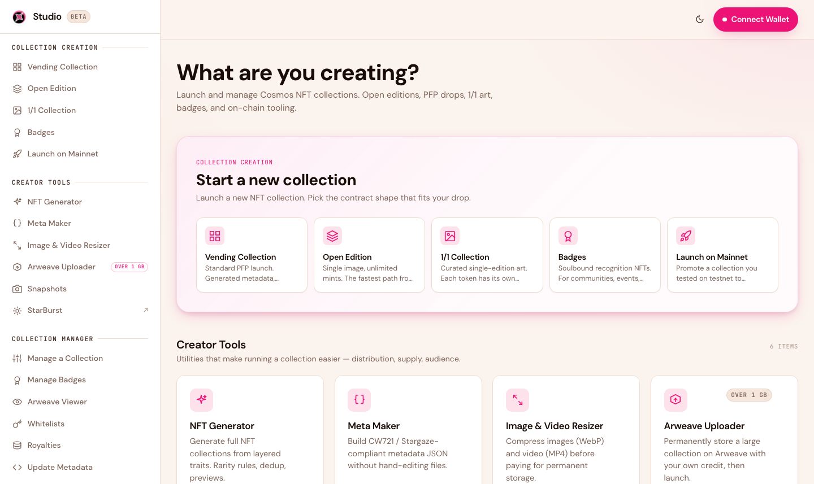

# Getting Started

This page walks you from opening Studio 2.0 to launching your first collection. The golden rule: **rehearse on testnet, then promote to mainnet.** The on-chain steps — creating the collection, minting, whitelists — are free to practice on the Cosmos Hub testnet. Storage works differently: Arweave has no testnet, so your art and metadata upload to permanent storage for real, once — and those same files carry straight to mainnet.

<figure><figcaption>Open Studio 2.0 and connect your wallet to begin.</figcaption></figure>

## 1. Open Studio 2.0

Go to [studio.stargaze.zone](https://studio.stargaze.zone).

## 2. Connect your wallet

Click **Connect Wallet** (top right) and connect **Keplr**. Studio 2.0 uses your normal Cosmos wallet — the same one you use to collect on Stargaze. You'll approve each action from the wallet as you go; Studio never holds your keys.

## 3. Rehearse on testnet

Every collection starts on the **Cosmos Hub testnet**, so you can get the on-chain parts right before going live:

1. Pick a collection type from the sidebar (e.g. [Vending Collection](https://studio.stargaze.zone/collections/vending/create)).
2. Build it exactly as you want it — art, metadata, mint price, whitelist, timing.
3. Launch it on testnet. You don't need to go hunting for testnet ATOM — while you're creating a collection, the app tops up your testnet balance automatically every 24 hours.
4. Preview the live testnet drop and walk the pre-launch checklist.


**Storage is the exception to "testnet is free."** Arweave has no testnet, so uploading your art and metadata stores them permanently — for real — even during a testnet rehearsal. The upside: you pay for storage only once, and those exact files are reused on mainnet, so you never re-upload or pay for storage twice. See [What is Arweave?](what-is-arweave.md)


## 4. Promote to mainnet

When your testnet drop looks right, use **Launch on Mainnet** to promote the same collection to **Cosmos Hub mainnet** in one step. Studio reuses your Arweave uploads and only runs the on-chain creation transaction — no second storage charge.

## What you'll pay

* **On-chain testnet fees:** free — the app tops up your testnet ATOM automatically.
* **Storage (Arweave):** a one-time fee, paid when your files upload during the testnet build. It's priced by total file size, permanent, and never charged again — there's no Arweave testnet.
* **On-chain mainnet fees:** the collection-creation fee (varies by type and size) plus network gas, in real ATOM. Your Arweave files carry over, so there's no second storage charge.

Everything is shown live in the app before you confirm. See [Costs & Fees](costs-and-fees.md) for the full breakdown.

## Next steps

* [Create a Collection](creating-a-collection.md) — the collection types, step by step
* [Whitelists](whitelists.md) — allowlist phases and presale pricing
* [Manage Your Collection](managing-your-collection.md) — everything you can change after launch
