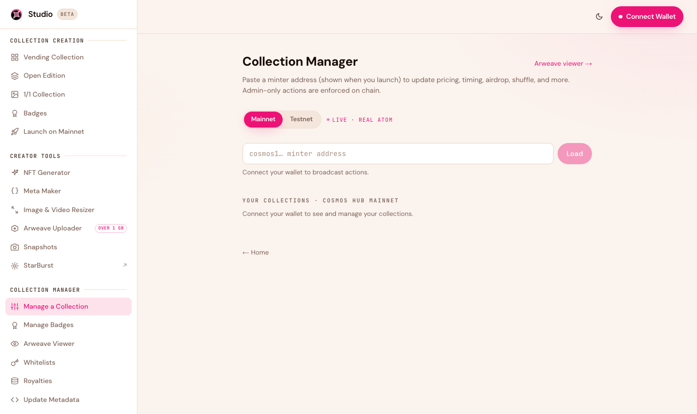
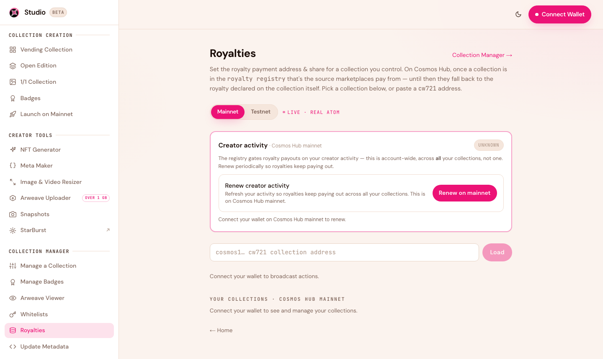
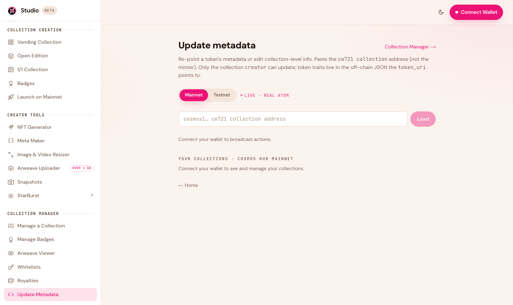

# Managing Your Collection

After launch, the **Collection Manager** is where you run your drop — update pricing and timing, airdrop tokens, manage your whitelist, set royalties, and edit metadata. Admin-only actions are enforced on-chain, so only the collection's creator wallet can make changes.

<figure><figcaption>Paste a collection address to load it, then manage it. The network toggle keeps testnet and mainnet separate.</figcaption></figure>

## Loading a collection

Open [Manage a Collection](https://studio.stargaze.zone/manage) and paste your collection address (the one shown when you launched). Toggle **Mainnet / Testnet** to match where your collection lives. Connect your wallet to broadcast changes; once connected, your own collections are listed automatically.

## What you can change

Depending on the collection type, the manager lets you:

* **Pricing** — update the mint price and per-wallet limit.
* **Timing** — change the mint start, mint end, and secondary-trading start.
* **Airdrop** — mint tokens directly to any address (great for team allocations or giveaways).
* **Supply tools** — shuffle the reveal order, or burn the remaining unminted supply.
* **Withdraw** — collect your mint proceeds.
* **Whitelist** — attach or replace the whitelist. See [Whitelists](whitelists.md).


**Linked times.** When you change a whitelist phase boundary or the mint start, Studio automatically carries the change to everything that depends on it — in a single transaction — so your phases and mint window always stay consistent. No hunting through multiple screens to keep dates in sync.


## Royalties

<figure><figcaption>Set or update your secondary-sale royalty and payout address.</figcaption></figure>

Set the percentage you earn on secondary sales and the address it's paid to — a single wallet, a multisig, or a split. Your royalty is paid automatically to that address on every resale. A common range is **2–5%**: high enough to earn, low enough that it doesn't discourage trading. You can update it later from [Royalties](https://studio.stargaze.zone/manage/royalties).


**Renew your royalties every year.** A collection's royalties are reduced to 0% if the creator doesn't stay active. To keep them enforced, renew your creator activity once a year from the [Royalties](https://studio.stargaze.zone/manage/royalties) manager in Studio.


## Update metadata

<figure><figcaption>Update the metadata of individual tokens in your collection.</figcaption></figure>

Update the metadata of individual **tokens** in your collection — the pointer to each token's image, name, and traits. From [Update Metadata](https://studio.stargaze.zone/manage/metadata) you can also permanently **freeze** a token's metadata so it can never change again.

## What can't be changed

Some things are fixed at launch and permanent:

* **Total supply** (for fixed-supply collections)
* **The collection's contract address**
* **Your permanent Arweave art** (that's the point — it can't be lost *or* swapped)

## Next steps

* [Whitelists](whitelists.md) — manage allowlist phases
* [Costs & Fees](costs-and-fees.md) — what management actions cost in gas
