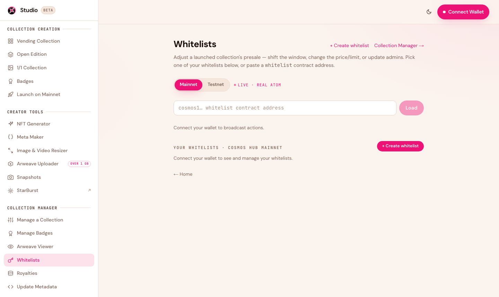
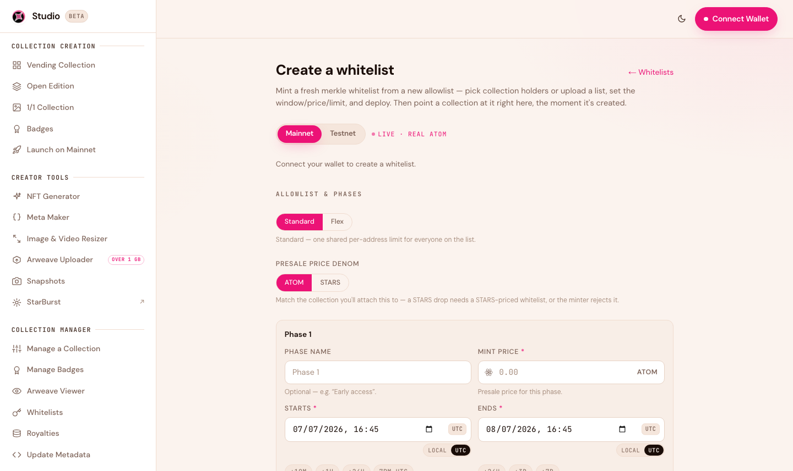

# Whitelists

A whitelist (allowlist) lets a specific set of wallets mint before — or on better terms than — the public. Studio 2.0 supports **multi-phase** whitelists, so you can run, say, a free early-supporter phase, then a discounted community phase, then the public mint, each with its own price, timing, and wallet list.

<figure><figcaption>The Whitelist manager: preview and export members, configure phases, and set a whitelist on a collection.</figcaption></figure>

## How whitelists work

Each phase has:

* **Its own list of wallets** — these mint during that phase.
* **Its own price and window** — often a discount, opening before the public mint.
* **Per-wallet limits** — how many each address can mint.

Phases run back-to-back: when one ends, the next begins, and the public mint opens after the last phase closes.

## Adding wallets

You can build a phase's list from:

* **A CSV or pasted list** of addresses. Both `cosmos1…` and `stars1…` addresses are accepted (Studio converts them automatically).
* **A holder snapshot** — allowlist the holders of another collection. Build the list with [Snapshots](creator-tools.md), then drop it in.

Studio **de-duplicates** every list automatically, so overlapping sources never create problems.

## Preview and export your members

Studio 2.0 keeps a local copy of each phase's member list so you can **preview** it (with a full-list view) and **download it as a CSV** at any time — one list per phase.


The whitelist contract itself only stores a cryptographic fingerprint of your list (a "merkle root"), not the addresses. Studio keeps the readable copy for you on the device you built it on. If you need it elsewhere, download the CSV.


## Creating and setting a whitelist

<figure><figcaption>Build a standalone whitelist, then point it at any of your collections.</figcaption></figure>

You can add a whitelist while creating a collection, or build one on its own and attach it later:

1. Open [Whitelists → Create](https://studio.stargaze.zone/manage/whitelists/create).
2. Add your phases, prices, windows, and wallet lists.
3. Pick the network (testnet or mainnet) and the mint token (ATOM or STARS).
4. Deploy the whitelist, then use **Set on collection** to attach it to any collection you manage.

Studio runs a pre-flight check (matching mint token, mint not yet started) before it sets the whitelist, so you can't accidentally attach an incompatible one.

## Next steps

* [Manage Your Collection](managing-your-collection.md) — adjust phase timing after launch
* [Creator Tools](creator-tools.md) — snapshot holders to build an allowlist
